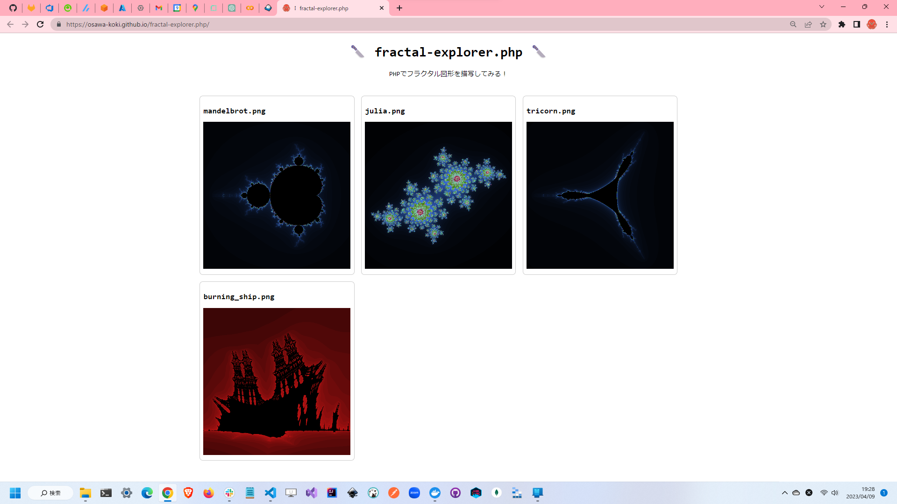

# fractal-explorer.php

🔪🔪🔪 PHPでフラクタルを描画する！  

  

## 描写したフラクタル図形

- [x] マンデルブロ集合
- [x] ジュリア集合
- [x] トライコーン集合
- [x] バーニングシップ集合

## 実行方法

DevContainerに入って、以下のコマンドを実行します。  

```shell
php ./app.php
```

各種設定は、`./config.json`を編集してください。  
